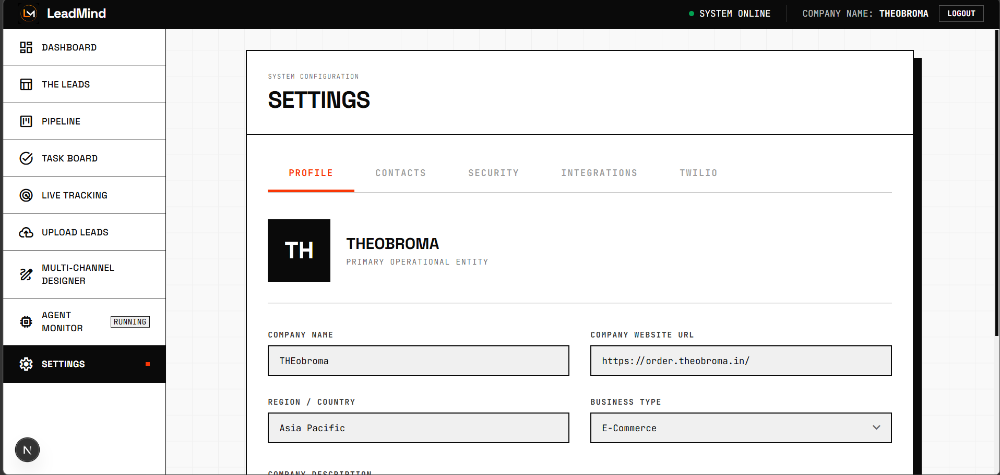

# ⚡ LeadMind: The Autonomous Multi-Agent Sales Engine

**LeadMind** is a state-of-the-art Sales Development Representative (SDR) automation platform. It leverages a sophisticated **Multi-Agent Architecture** to bridge the gap between high-scale automation and deep, human-like personalization.

By combining real-time behavioral tracking with autonomous AI research agents, LeadMind identifies high-intent prospects and engages them with hyper-personalized outreach exactly when they are most likely to convert.

---

## 🛠️ System Architecture
The core of LeadMind is built on **LangGraph**, orchestrating a sequence of specialized AI agents that process leads through a neural pipeline.

---

## 🚀 Platform Features

### 1. Centralized Dashboard
Get a high-level overview of your entire sales operation, including conversion rates, active campaigns, and intent-score distributions.

### 2. The Lead Ledger
A high-density data grid for managing your prospects. View enriched firmographics, social links, and AI-generated intent summaries in one place.

### 3. Agent Monitor (Live Pipeline)
Watch your AI agents work in real-time. This view shows the "Swim Lane" visualization of the 5-agent pipeline as it researches and drafts outreach for your batches.

---

## 🔍 Deep Lead Intelligence & Outreach Channels

### 🧬 Identity, Enrichment & Intent Analytics
The `LeadPage` command center provides a unified view of lead identity, firmographic enrichment, and live intent scoring. It also monitors real-time email tracking signals (opens/clicks).

### ✍️ AI Drafting, Scraping & Follow-up Timers
Our content agents use web-scraping to gather company context, then automatically draft personalized emails while managing strategic follow-up timers.

### 💬 SMS Channel Outreach
Integrated SMS engagement wing for instant, high-deliverability mobile follow-ups.

### 🟢 WhatsApp Business Integration
AI-powered WhatsApp outreach for deep engagement on the world's most popular messaging platform.

### 📞 AI Voice & Call Assistant
Automated voice-mail drops and intent-triggered AI calls for high-value priority targets.

### 📝 CRM Logging & Performance Audit
Every AI action, status change, and communication event is logged in a transparent audit trail for CRM synchronization.

### 📊 Behavioral SDK & Visitor Profiling
The LeadMind SDK captures deep visitor metrics: Engagement Scores, Pages Viewed, Time on Site, and Max Scroll depth.

---

## 🔄 The Pipeline Workflow

### Multi-Channel Pipeline
A visual Kanban board to track every deal from "New Lead" to "Meeting Booked." The AI automatically transitions leads based on their engagement.

### Multi-Channel Designer
Draft and preview hyper-personalized email templates and LinkedIn messages that adapt their content based on the AI's research findings.

### Strategic Task Board
When the AI detects a situation requiring human intervention, it automatically generates high-priority tasks for your sales team.

### Platform Settings
Configure your AI model preferences, SMTP credentials, and SDK API keys to tailor the engine to your brand.

---

## 🧠 The Agent Intelligence Suite
*   **AGN_RES (Research)**: Deep-scrapes the web for company USPs and pain points.
*   **AGN_INT (Intent)**: Scores leads based on live behavioral pulses from the SDK.
*   **AGN_TIM (Timing)**: Optimizes dispatch windows based on lead timezones.
*   **AGN_CRM (Logger)**: Ensures every AI action is audited and logged to MongoDB.
*   **AGN_MUL (Drafter)**: Generates 1:1 personalized content fragments for outreach.

---

## 📺 Demo Video
Click the link below to watch LeadMind in action:

[**WATCH THE DEMO VIDEO HERE**](https://your-video-link-here.com)

---

## ⚙️ Tech Stack
- **Backend**: FastAPI, LangGraph, Motor (Async MongoDB), BeautifulSoup4
- **Frontend**: Next.js 14, TailwindCSS, Lucide-React
- **Database**: MongoDB Atlas
- **Orchestration**: LangChain, OpenAI GPT-4o
- **Connectivity**: Twilio, SMTP, Cloudflare Tunnels

---
*Built with ❤️ by the LeadMind Team.*
