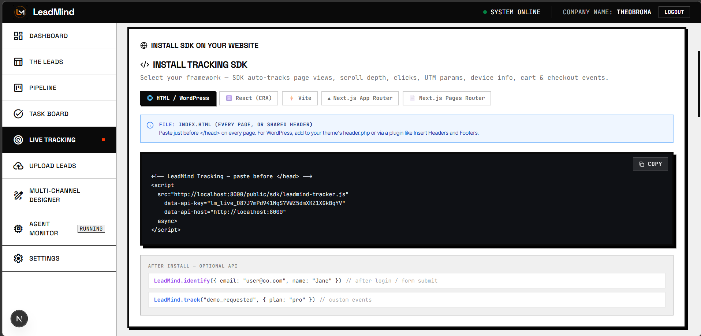

# ⚡ LeadMind: The Autonomous Multi-Agent Sales Engine

**LeadMind** is a state-of-the-art Sales Development Representative (SDR) automation platform. It leverages a sophisticated **Multi-Agent Architecture** to bridge the gap between high-scale automation and deep, human-like personalization.

By combining real-time behavioral tracking with autonomous AI research agents, LeadMind identifies high-intent prospects and engages them with hyper-personalized outreach exactly when they are most likely to convert.

---

## 🛠️ System Architecture
The core of LeadMind is built on **LangGraph**, orchestrating a sequence of specialized AI agents that process leads through a neural pipeline.

---

## 🚀 Platform Features

### 1. Centralized Dashboard
Get a high-level overview of your entire sales operation, including conversion rates, active campaigns, and intent-score distributions.

### 2. The Lead Ledger
A high-density data grid for managing your prospects. View enriched firmographics, social links, and AI-generated intent summaries in one place.

### 3. Real-Time Tracking SDK
Our lightweight JavaScript SDK captures every move a prospect makes on your site—page views, scroll depth, and repeat visits—to feed the Intent Scorer.

### 4. Agent Monitor (Live Pipeline)
Watch your AI agents work in real-time. This view shows the "Swim Lane" visualization of the 5-agent pipeline as it researches and drafts outreach for your batches.

---

## 🔍 Deep Lead Intelligence & Automation

LeadMind provides granular insights for every prospect, powered by a multi-agent intelligence wing that goes far beyond basic data enrichment.

### 📧 Email Intelligence & Tracking
Every email sent through LeadMind is embedded with a **1:1 transparent tracking pixel** and proprietary **link-wrapping logic**. 
*   **Open Detection**: Real-time notification when a lead views your message.
*   **Click Analytics**: Track exactly which links in your personalized draft resonate with the prospect.
*   **Reply Correlation**: Automatic status updates when a prospect responds.

### 🌐 Intelligent Web Scraping & Product Context
The `AGN_RES` agent performs deep-scrapes of prospect domains to identify specific **Product Images**, USPs, and brand aesthetics.
*   **Contextual Extraction**: Pulls latest blog posts, news, and product updates to write lines like: *"I noticed your recent launch of [Product Name]..."*
*   **Brand Alignment**: Automatically identifies the lead's industry and region to tailor the tone of voice.

### 📱 Multi-Channel Execution (WhatsApp & SMS)
Powered by **Twilio**, LeadMind extends personalization to mobile channels. 
*   **WhatsApp Templates**: Send approved AI-drafted messages directly to the prospect's mobile device.
*   **SMS Follow-ups**: Automated "Touch-base" messages triggered when a lead's intent score reaches a specific threshold.

### 📞 AI Voice/Call Assistant
For high-value "Hot Leads," the system can trigger an **AI Voice Assistant** to execute automated follow-up calls or personalized voice-mail drops.
*   **Intent-Triggered Dialing**: Automatically queues a call when a lead visits the pricing page multiple times.
*   **Conversation Logging**: Every call attempt is recorded and summarized in the lead's action history.

### 📊 Behavioral SDK & Intent Analysis
The system processes raw event logs to build a "Digital Twin" of the prospect's interest.
*   **Event Log Trace**: View every click and scroll event in a chronological timeline.
*   **Dynamic Intent Scoring**: Intent is recalculated every 3 minutes based on fresh SDK activity.

---

## 🔄 The Pipeline Workflow

### Multi-Channel Pipeline
A visual Kanban board to track every deal from "New Lead" to "Meeting Booked." The AI automatically transitions leads based on their engagement.

### Multi-Channel Designer
Draft and preview hyper-personalized email templates and LinkedIn messages that adapt their content based on the AI's research findings.

### Strategic Task Board
When the AI detects a situation requiring human intervention, it automatically generates high-priority tasks for your sales team.

---

## 🧠 The Agent Intelligence Suite
*   **AGN_RES (Research)**: Deep-scrapes the web for company USPs and pain points.
*   **AGN_INT (Intent)**: Scores leads based on live behavioral pulses from the SDK.
*   **AGN_TIM (Timing)**: Optimizes dispatch windows based on lead timezones.
*   **AGN_CRM (Logger)**: Ensures every AI action is audited and logged to MongoDB.
*   **AGN_MUL (Drafter)**: Generates 1:1 personalized content fragments for outreach.

---

## 📺 Demo Video
Click the link below to watch LeadMind in action:

[**WATCH THE DEMO VIDEO HERE**](https://your-video-link-here.com)

---

## ⚙️ Tech Stack
- **Backend**: FastAPI, LangGraph, Motor (Async MongoDB), BeautifulSoup4
- **Frontend**: Next.js 14, TailwindCSS, Lucide-React
- **Database**: MongoDB Atlas
- **Orchestration**: LangChain, OpenAI GPT-4o
- **Connectivity**: Twilio, SMTP, Cloudflare Tunnels

---
*Built with ❤️ by the LeadMind Team.*
