# ⚡ LeadMind: The Autonomous Multi-Agent Sales Engine

**LeadMind** is a state-of-the-art Sales Development Representative (SDR) automation platform. It leverages a sophisticated **Multi-Agent Architecture** to bridge the gap between high-scale automation and deep, human-like personalization.

By combining real-time behavioral tracking with autonomous AI research agents, LeadMind identifies high-intent prospects and engages them with hyper-personalized outreach exactly when they are most likely to convert.

---

## 🛠️ System Architecture
The core of LeadMind is built on **LangGraph**, orchestrating a sequence of specialized AI agents that process leads through a neural pipeline. The system maintains a persistent "State" object that matures as each agent enriches the lead profile.

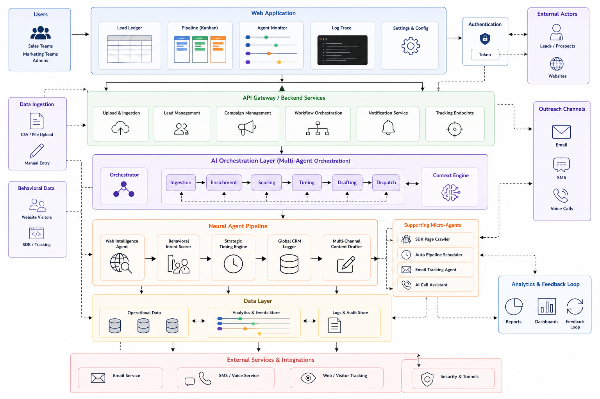

---

## 🚀 Platform Features

### 1. Centralized Dashboard
The executive command center for your sales operation. It visualizes core KPIs including conversion velocity, lead acquisition cost, and a breakdown of intent-score distribution across your total addressable market.
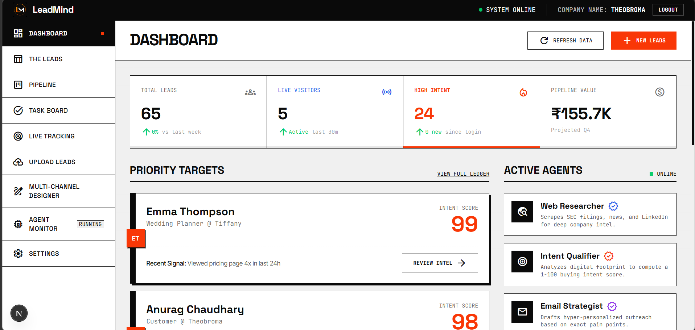

### 2. The Lead Ledger (Unified Intelligence)
A high-density, low-latency data grid designed for rapid lead management. It provides a single-pane-of-glass view into enriched firmographics, validated social links, and AI-summarized company intelligence, allowing for instant filtering by "completed" and "dispatched" status.
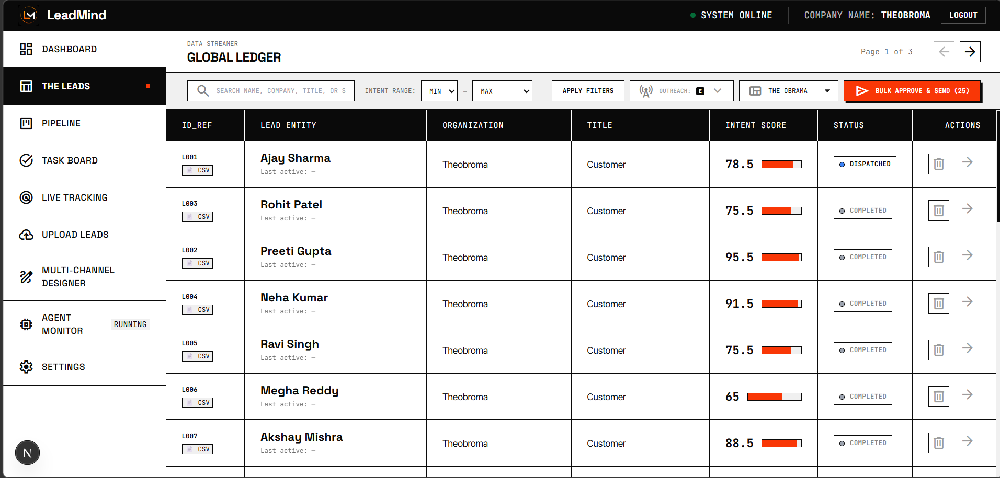

### 3. Agent Monitor (Neural Pipeline Trace)
Transparency into the "Hidden SDR" workforce. This real-time visualization tracks the progress of each AI agent (Research, Intent, Timing, CRM, and Drafter) as they process high-volume batches through the LangGraph pipeline.
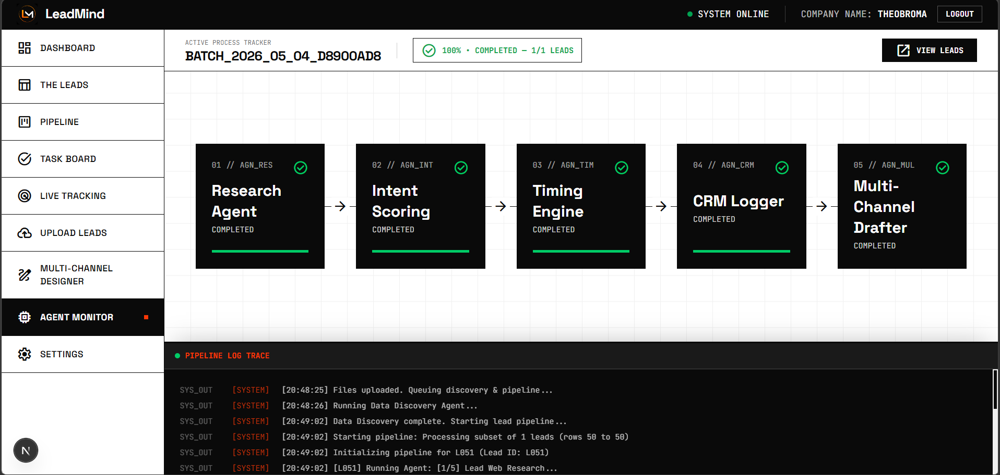

---

## 🔍 Detailed Lead Intelligence & Outreach Channels

### 🧬 Identity, Enrichment & Intent Analytics
The LeadMind enrichment wing automatically identifies the prospect's company size, industry, and exact office region. It simultaneously processes real-time tracking signals—such as email opens and link clicks—to build a multi-dimensional picture of the prospect's receptivity.
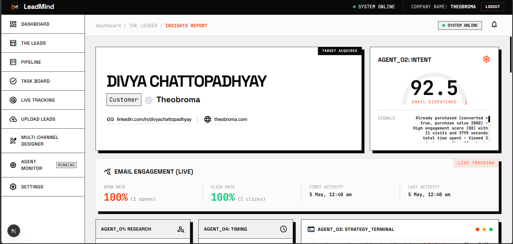

### ✍️ AI Content Drafting, Web Scraping & Strategic Follow-up Timers
Our drafting agents perform deep web-scrapes of company domains to extract specific product contexts and USPs. This data is injected into hyper-personalized email drafts, while autonomous "Timing Engines" manage strategic follow-up intervals to ensure your messages hit the inbox at peak engagement hours.
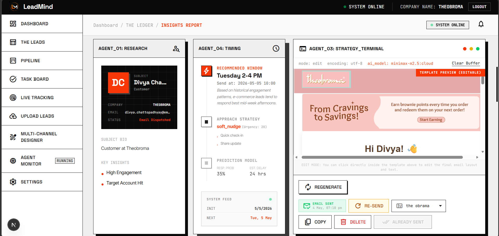
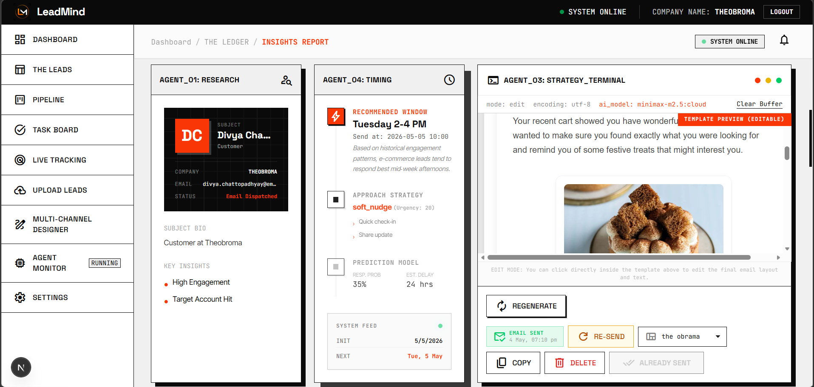

### 💬 SMS Channel Integration
High-deliverability SMS engagement for immediate, direct-to-mobile follow-ups. This channel is primarily used for urgent intent alerts or "quick-touch" relationship building, ensuring you stay top-of-mind.
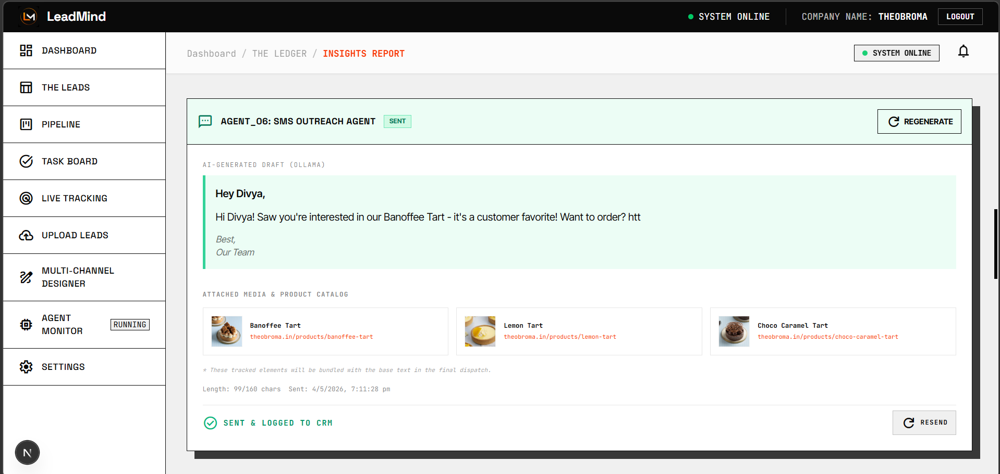

### 🟢 WhatsApp Business Intelligence
Harness the power of the world’s most active messaging platform. LeadMind drafts and manages WhatsApp outreach, allowing for rich-media engagement and high-response conversational threads.
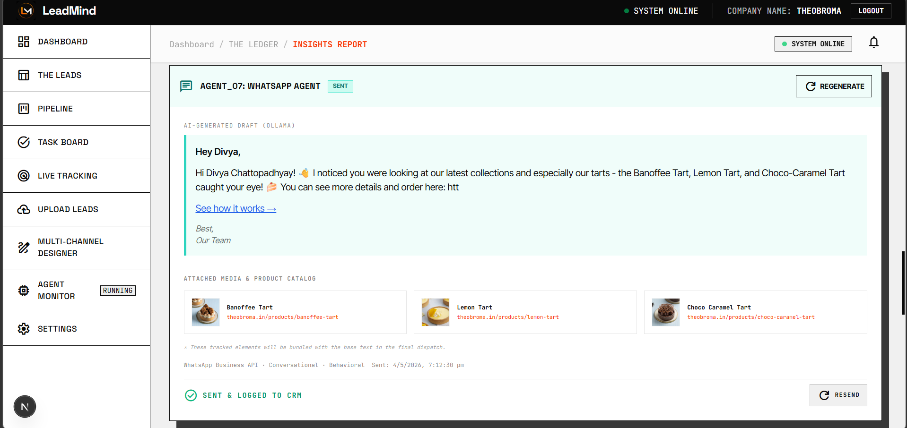

### 📞 AI Voice & Virtual Call Assistant
When a lead completed its pipeline processing, the system can trigger an AI-driven Voice Assistant to execute automated **AI CALL ASSISTANT**, bridging the gap between digital and verbal engagement.
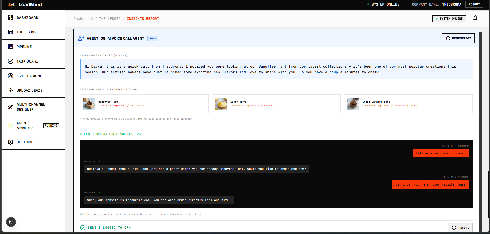

### 📝 CRM Performance Audit & Logger
Ensuring 100% transparency. The `AGN_CRM` agent maintains a rigorous audit trail of every status transition, communication event, and AI-generated draft, keeping your core database perfectly in sync with your team's workflow.
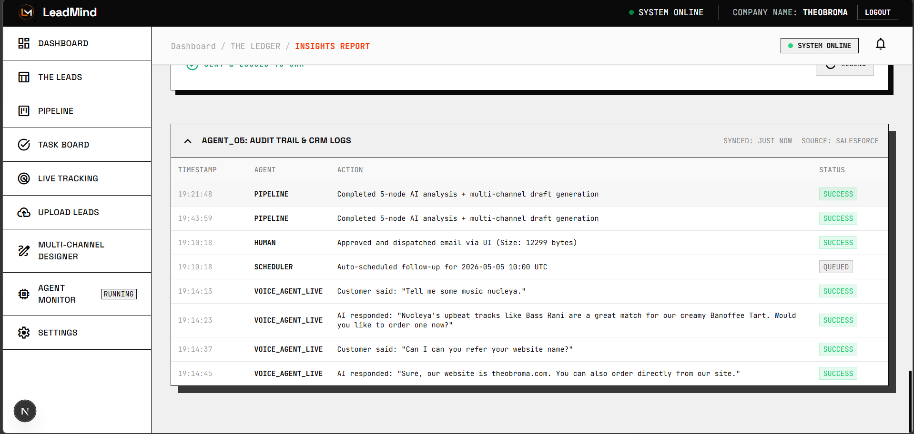

### 📊 Behavioral SDK & Visitor Profiling
The LeadMind SDK provides the "Digital DNA" of your visitors. It tracks deep engagement metrics including **Visitor Behavioral Profiles**, **Intent Score (e.g., 65/100)**, **Total Pages Viewed**, **Dwell Time**, and **Max Scroll Depth**—allowing you to distinguish casual browsers from active buyers.
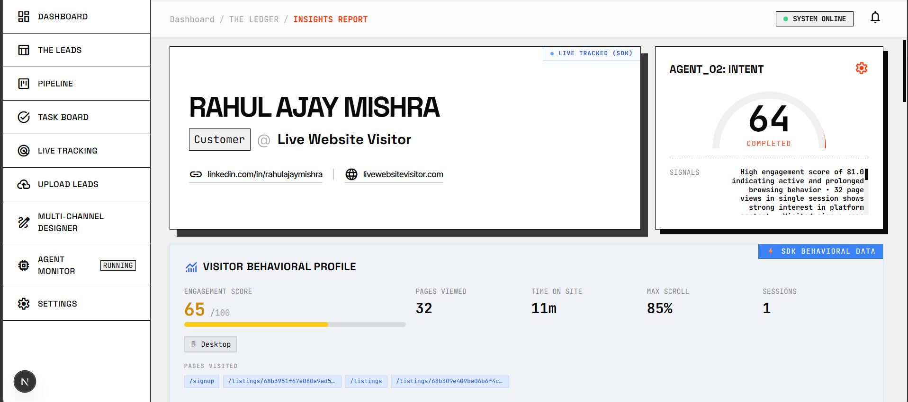

---

## 🔄 The Pipeline Workflow

### Multi-Channel Kanban Pipeline
A visual deals board that manages the lifecycle of a lead. The AI automatically transitions prospects through custom stages (New Lead -> Dispatched -> Meeting Booked) based on engagement signals captured by the SDK and tracking pixel.
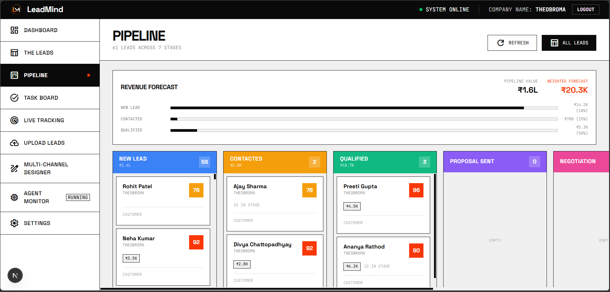

### High-Fidelity Multi-Channel Designer
Create and test dynamic templates that adapt their content fragments based on the AI's research. Preview exactly how your personalization will appear across Email, SMS,Whatsapp and AI Caller.
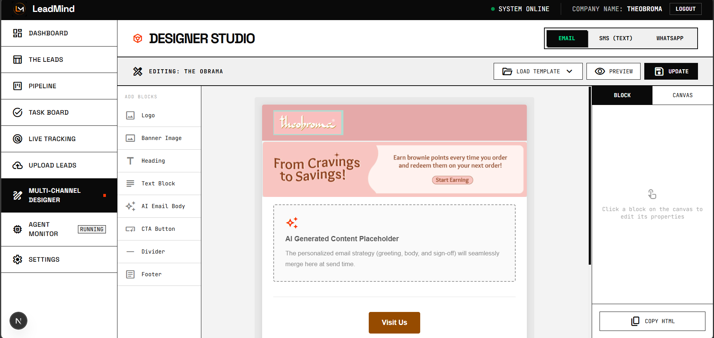

### Strategic Task Board
For complex leads requiring a "Human Touch," the system automatically generates high-priority manual tasks. This ensures your human SDRs spend their time on high-leverage closing activities rather than data entry.
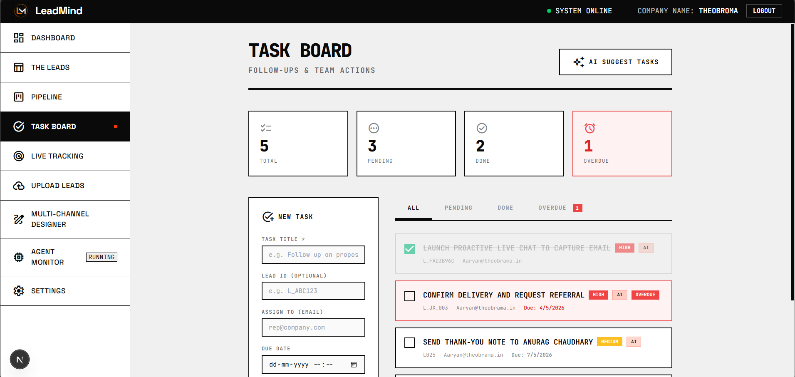

---

## 🧠 The Agent Intelligence Suite
*   **AGN_RES (Research)**: Deep-scrapes the web for company USPs and pain points.
*   **AGN_INT (Intent)**: Scores leads based on live behavioral pulses from the SDK.
*   **AGN_TIM (Timing)**: Optimizes dispatch windows based on lead timezones.
*   **AGN_CRM (Logger)**: Ensures every AI action is audited and logged to MongoDB.
*   **AGN_MUL (Drafter)**: Generates 1:1 personalized content fragments for outreach.

---

## 📺 Demo Video
Click the link below to watch LeadMind in action:

[**WATCH THE DEMO VIDEO HERE**](https://drive.google.com/file/d/1z9Wme1SUSWEZovgsQ2Lw3eknU-esfZno/view?usp=sharing)

---

# 🚀 Tech Stack

## ⚙️ Backend

---

## 🎨 Frontend

---

## 🗄️ Database

---

## 🤖 AI / Orchestration

---

## 🌐 Connectivity & Services

---
*Built with ❤️ by the LeadMind Team.*
